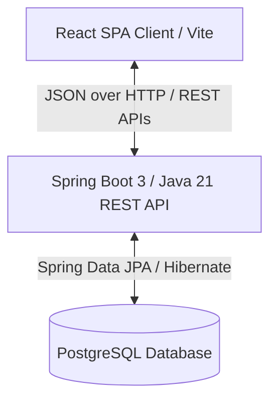

# ZenoHosp HMS — Architecture Documentation

Welcome to the central Architecture guide for **ZenoHosp HMS** (Hospital Management System), an enterprise-grade performance-optimized clinical and administrative platform.

---

## 1. System Overview & Technology Stack

ZenoHosp HMS operates on a decoupled client-server architecture built on standard state-of-the-art frameworks.



### Core Architecture Components:
1. **Frontend**: A Single Page Application built using **React** and **Vite** with **Vanilla CSS** styling, integrated with **Recharts** for real-time visual analytics.
2. **Backend**: A **Spring Boot 3** app running on **Java 21**, implementing secure RESTful controllers, JPA repositories, transactional service layers, and background task scheduling.
3. **Database**: **PostgreSQL** database. Identifiers (like `Hospital.id`) are mapped as **UUIDs** to ensure unique mapping and high security across multiple facilities.

---

## 2. Dynamic Performance Architectures & Enhancements

This section tracks high-impact performance optimizations and structural cleanups implemented to scale the system for large hospitals.

### A. Dashboard Data Consolidation (`DashboardController`)
* **Problem**: Originally, the administrative dashboard made 6 concurrent API calls on mount, loading entire sets of active records (all staff, all patients, all invoices, etc.) and performing client-side mapping/computations.
* **Fix**: Unified dashboard computations into a **single consolidated backend REST endpoint** (`/api/dashboard/summary`). 
* **Details**: Replaced concurrent UI fetches with a native database consolidation query inside `DashboardService` / `DashboardRepository`, serving the entire metric list (registrations, room occupancy, balances, designations) in a single unified JSON payload.

### B. Server-Side Patients Pagination (`Patients.jsx`)
* **Problem**: The Patients portal fetched all patient records at once, loading thousands of data rows into memory and filtering/paginating in the browser.
* **Fix**: Migrated to database-level pagination using Spring Data `Pageable` and JPA native searching.
* **Details**: 
  - Exposed `/api/patients/paginated` supporting dynamic searches.
  - Set default page boundaries to return exactly `30` rows at a time.
  - Implemented debounced input search (`400ms` buffer) in `Patients.jsx` to prevent database flood on keystrokes.

### C. IPD Estimate Sync Background Job
* **Problem**: The billing page loaded all unpaid/unsettled IPD invoices hospital-wide and ran room charge and consultation estimations in the browser on page load (zeroPending bulk loops).
* **Fix**: Offloaded the estimation sync to a background scheduler running every 30 minutes.
* **Details**:
  - Activated `@EnableScheduling` in the main application entry points.
  - Developed `InvoiceSyncScheduler.java` executing candidate syncs at `fixedRate = 1800000` ms (30 mins).
  - Candidates are selected dynamically in the database via `InvoiceRepository.findZeroPendingIpdInvoices()`.
  - Estimates are computed using existing rules in `SmartBillingService.computeEstimatedTotal(Integer, UUID)`.

### D. Billing Page Split & Server-Side Pagination (`OPDBilling.jsx` & `IPDBilling.jsx`)
* **Problem**: The old `Billing.jsx` page was a massive monolithic file handling both OPD and IPD tabs simultaneously, fetching all invoices at once, and using client-side searching and pagination, causing high latency and performance lags.
* **Fix**: Split the dashboard into two separate, optimized pages, and migrated to server-side search and database-level pagination.
* **Details**:
  - Created `OPDBilling.jsx` for outpatient invoices (no admission linked).
  - Created `IPDBilling.jsx` for inpatient invoices (admission linked) with integrated smart active admission tracking.
  - Implemented backend pagination using Spring Data `Pageable` via `/api/invoices/opd/paginated` and `/api/invoices/ipd/paginated`.
  - Updated all dashboard shortcuts, quick actions, patient details history, and navigation links globally.

### E. Grouped Billing Left-Pane Navigation Accordion
* **Problem**: Splitting OPD and IPD billing into separate dedicated views originally threatened to clutter the sidebar list with multiple flat links.
* **Fix**: Unified both pages inside a single, collapsible **Billing** accordion parent element.
* **Details**:
  - Integrated state management (`billingOpen`) into `Sidebar.jsx` using React hooks.
  - Placed `OPDBilling.jsx` (`/billing/opd`) and `IPDBilling.jsx` (`/billing/ipd`) as nested sub-menus with indented styling (`pl-8`).
  - Implemented the accordion visual styling, using a dynamic chevron that automatically rotates 180° when expanded or collapsed, keeping the global design system elegant and consistent.

---

## 3. Directory Layout Reference

### A. Backend Structure (`HMS-backend`)
```text
com.zenlocare.HMS_backend/
├── HmsBackendApplication.java    # Main Entry Point & @EnableScheduling
├── controller/
│   ├── AuthController.java       # User authentication & session endpoints
│   ├── BillingController.java    # Invoicing and payment endpoints
│   ├── DashboardController.java  # Consolidated dashboard overview endpoint
│   └── PatientController.java    # Patient profiling and pagination endpoints
├── service/
│   ├── InvoiceService.java       # Core billing operations & updateEstimatedTotal
│   ├── SmartBillingService.java  # Suggestion calculations (computeEstimatedTotal)
│   ├── PatientService.java       # Server-side patient lookup logic
│   └── DashboardService.java     # Single-query dashboard metrics aggregation
├── repository/
│   ├── InvoiceRepository.java    # Custom candidate JPQL queries
│   └── PatientRepository.java    # Case-insensitive paginated JPA search
└── scheduler/
    └── InvoiceSyncScheduler.java # 30-minute background estimate updates
```

### B. Frontend Structure (`HMS-frontend`)
```text
src/
├── pages/
│   ├── admin/
│   │   └── AdminDashboard.jsx    # Clean dashboard calling /api/dashboard/summary
│   ├── billing/
│   │   ├── OPDBilling.jsx        # Outpatient billing with server-side pagination
│   │   └── IPDBilling.jsx        # Inpatient billing with active admission finalization
│   └── patients/
│       └── Patients.jsx          # Server-side paginated patient list
├── components/
│   └── common/
│       └── Pagination.jsx        # Reusable page control widget
└── utils/
    └── api.js                    # API mapping layers (Axios clients)
```
