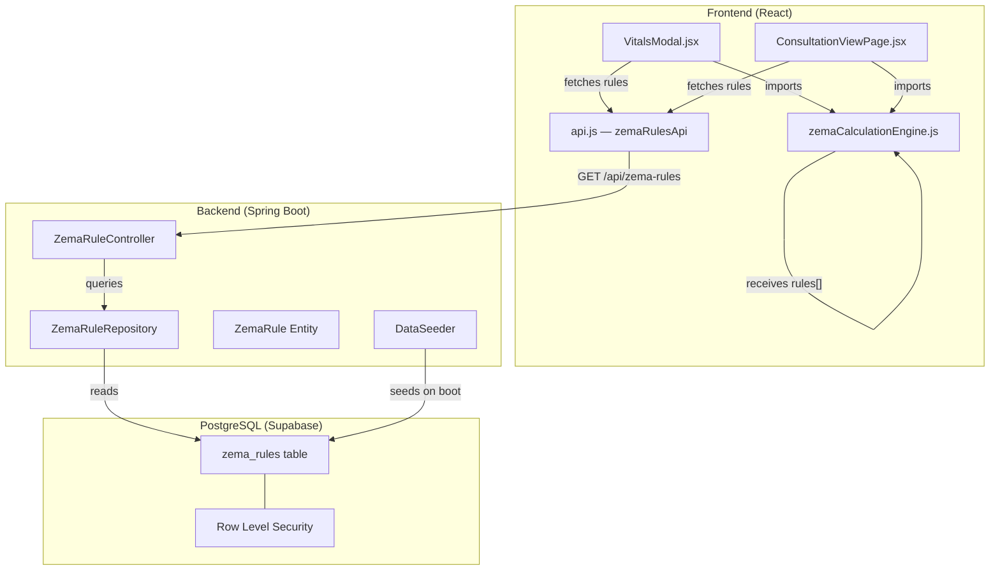
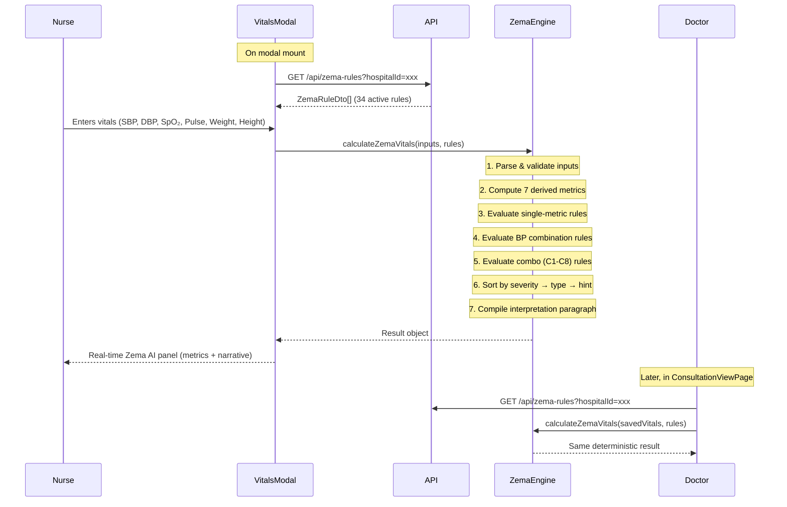
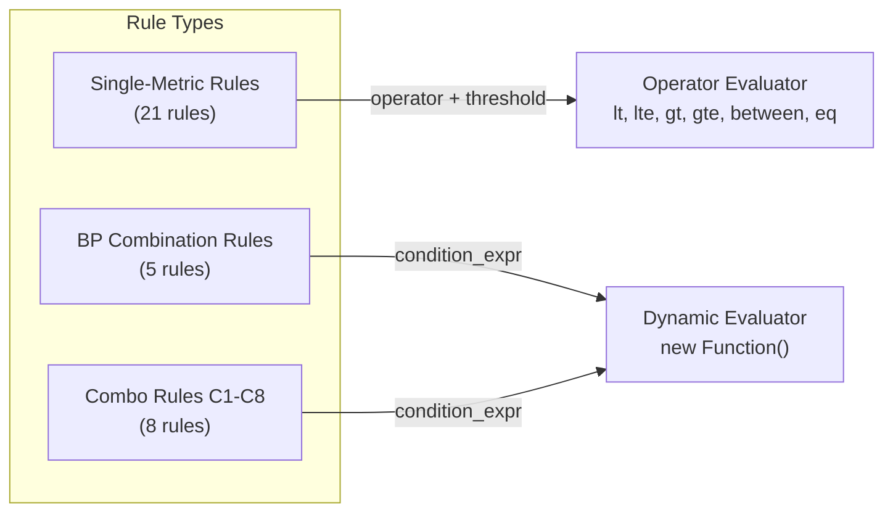

# Zema AI — Architecture Document

> **Module**: Clinical Vitals Calculation & Interpretation Engine  
> **Parent System**: ZenoHosp HMS — Consultation Module  
> **Last Updated**: 2026-06-09  
> **Status**: Production

---

## 1. Overview

Zema AI is a **deterministic clinical rules engine** that computes derived vitals metrics and produces clinical decision-support interpretations from nurse-captured vital signs. It is embedded within the OPD consultation workflow and activates the moment vitals are recorded.

> [!IMPORTANT]
> **This is NOT an AI model.** Despite the branding, Zema AI uses zero machine learning, zero external API calls, and zero probabilistic inference. Every output is computed from explicit mathematical formulas and evaluated against database-driven threshold rules. This guarantees **reproducibility** — the same inputs always produce the same outputs, which is a hard requirement for medical records.

### 1.1 Design Principles

| Principle | Implementation |
|---|---|
| **Deterministic** | Pure arithmetic + threshold evaluation. No randomness, no ML. |
| **Decision Support, not Diagnosis** | Language uses "consider/review/suggest/consistent with" — never "the patient has X". |
| **Database-Driven Thresholds** | All thresholds and output text live in `zema_rules` table. An admin can retune (e.g., flag SpO₂ at 92 instead of 94) by editing a row — zero code changes. |
| **Graceful Degradation** | Missing fields → compute only metrics whose inputs are present, mark result "Partial". |
| **Pediatric Guard** | Age < 18 → bypass all adult interpretation rules. IAP growth chart referral note is emitted instead. |
| **Multi-Tenant** | Rules support per-hospital overrides via `hospital_id`. System-wide defaults have `hospital_id = NULL`. |

---

## 2. System Architecture



---

## 3. Data Flow



---

## 4. Inputs

Captured by the nurse before the doctor starts the consultation. Stored in `appointment_vitals` table.

| Field | Type | Unit | Valid Range | Required |
|---|---|---|---|---|
| `age` | integer | years | 0–120 | Yes |
| `sex` | string | M/F | — | Yes |
| `sbp` | integer | mmHg | 60–300 | Yes |
| `dbp` | integer | mmHg | 30–200 | Yes |
| `weight` | decimal | kg | 1–300 | Yes |
| `height` | decimal | cm | 30–250 | Yes |
| `spo2` | integer | % | 50–100 | Yes |
| `pulse` | integer | bpm | 30–250 | Yes |

### 4.1 Validation Rules

1. **Range check**: Each field must fall within its valid range. Out-of-range → field rejected, dependent metrics not computed.
2. **BP sanity**: If `dbp >= sbp` → both BP fields rejected, error message "Invalid BP entry (diastolic >= systolic)".
3. **Missing fields**: If any required field is absent → compute only metrics whose inputs are present, status = `"Partial - incomplete vitals"`.
4. **Pediatric guard**: If `age < 18` → all metrics are still computed, but interpretation rules are bypassed. A referral note to IAP age/sex-specific growth charts is emitted instead.

---

## 5. Computed Metrics

All formulas are implemented in [zemaCalculationEngine.js](file:///Users/iniyananbu/Documents/ZenoHosp%20Apps/HMS/HMS-frontend/src/utils/zemaCalculationEngine.js). Display values rounded to 1 decimal; full precision retained internally.

| # | Metric | Formula | Requires | Unit |
|---|---|---|---|---|
| 1 | **BMI** | `weight / (height_m²)` where `height_m = height / 100` | weight, height | kg/m² |
| 2 | **BSA** | `√(height × weight / 3600)` (Mosteller) | weight, height | m² |
| 3 | **MAP** | `dbp + (sbp − dbp) / 3` | sbp, dbp | mmHg |
| 4 | **Pulse Pressure** | `sbp − dbp` | sbp, dbp | mmHg |
| 5 | **Shock Index** | `pulse / sbp` | pulse, sbp | ratio |
| 6 | **IBW** | Devine: `base + 2.3 × (inches − 60)` where base = 50(M) / 45.5(F) | height, sex | kg |
| 7 | **BMR** | Mifflin-St Jeor: `10×weight + 6.25×height − 5×age + offset` where offset = +5(M) / −161(F) | weight, height, age, sex | kcal/day |

> [!NOTE]
> IBW returns `"N/A (height below formula range)"` when height ≤ 60 inches (≤ 152.4 cm), as the Devine formula is not validated below that threshold.

---

## 6. Interpretation Rules System

### 6.1 Rule Architecture

Rules are stored in the `zema_rules` database table and loaded at runtime. The engine evaluates them dynamically — **no thresholds are hardcoded in the engine**.



**Two evaluation paths:**

| Path | Used By | How It Works |
|---|---|---|
| **Operator Evaluator** | Single-metric rules | Compares metric value against `threshold_low`/`threshold_high` using the `operator` field (`lt`, `lte`, `gt`, `gte`, `between`, `eq`) |
| **Dynamic Evaluator** | Combination rules | Executes `condition_expr` as a JavaScript expression via `new Function()`. Variables `sbp, dbp, map, bmi, spo2, pulse, shockIndex, pulsePressure, age` are injected into scope. |

### 6.2 Single-Metric Rules (21 rules)

Each rule maps a single computed metric to a category + severity. On boundary overlap, the **higher severity wins**.

#### BMI (South Asian thresholds)

| # | Operator | Thresholds | Label | Severity |
|---|---|---|---|---|
| 1 | `lt` | < 18.5 | Underweight | warning |
| 2 | `between` | 18.5 – 23.0 | Normal | reassurance |
| 3 | `between` | 23.0 – 25.0 | Overweight at risk | warning |
| 4 | `gte` | ≥ 25.0 | Obese | warning |

#### SpO₂

| # | Operator | Thresholds | Label | Severity |
|---|---|---|---|---|
| 5 | `gte` | ≥ 95 | Normal | reassurance |
| 6 | `between` | 91 – 95 | Mild hypoxemia | warning |
| 7 | `between` | 85 – 91 | Moderate hypoxemia | critical |
| 8 | `lt` | < 85 | Severe hypoxemia | critical |

#### Pulse

| # | Operator | Thresholds | Label | Severity |
|---|---|---|---|---|
| 9 | `lt` | < 60 | Bradycardia | warning |
| 10 | `between` | 60 – 101 | Normal | reassurance |
| 11 | `gt` | > 100 | Tachycardia | warning |

#### Shock Index

| # | Operator | Thresholds | Label | Severity |
|---|---|---|---|---|
| 12 | `gt` | > 1.0 | Significantly elevated | critical |
| 13 | `between` | 0.9 – 1.0 | Elevated | warning |
| 14 | `between` | 0.7 – 0.9 | Borderline | info |
| 15 | `between` | 0.5 – 0.7 | Normal | reassurance |

#### Pulse Pressure

| # | Operator | Thresholds | Label | Severity |
|---|---|---|---|---|
| 16 | `lt` | < 25 | Narrow | warning |
| 17 | `between` | 25 – 60 | Normal | reassurance |
| 18 | `gt` | > 60 | Wide | warning |

#### MAP (Mean Arterial Pressure)

| # | Operator | Thresholds | Label | Severity |
|---|---|---|---|---|
| 19 | `lt` | < 65 | Low perfusion | critical |
| 20 | `between` | 65 – 100 | Normal | reassurance |
| 21 | `gt` | > 100 | Elevated | info |

---

### 6.3 Blood Pressure Combination Rules (5 rules)

BP classification uses WHO/Indian thresholds (≥140/90, NOT US ≥130/80). Classified by the **worse** of SBP/DBP. These rules use `metric = 'bp'` and the dynamic evaluator.

| # | Label | Condition | Severity |
|---|---|---|---|
| 22 | Hypotension | `sbp < 90 OR map < 65` | critical |
| 23 | Stage 2 hypertension | `sbp ≥ 160 OR dbp ≥ 100` | critical |
| 24 | Stage 1 hypertension | `sbp 140–159 OR dbp 90–99` | warning |
| 25 | High-normal | `sbp 120–139 OR dbp 80–89` | info |
| 26 | Normal | `sbp < 120 AND dbp < 80` | reassurance |

> [!NOTE]
> BP rules are evaluated separately from single-metric rules. All matching BP rules compete, and the **highest severity wins** — only one BP interpretation fires.

---

### 6.4 Multi-Condition Combination Rules — C1 through C8

These fire when **multiple conditions co-occur** and represent the clinician-synthesis output that makes Zema AI's narrative read as holistic clinical reasoning rather than isolated metric assessments. Multiple can fire simultaneously. Uses `metric = 'combo'`.

| ID | Label | Condition | Severity |
|---|---|---|---|
| C1 | Cardiometabolic risk cluster | BMI ≥ 23 AND (SBP ≥ 140 OR DBP ≥ 90) | critical |
| C2 | Respiratory compromise | SpO₂ < 94 AND Pulse > 100 | critical |
| C3 | Hemodynamic stress | Shock Index > 0.9 AND (SBP < 100 OR Pulse > 100) | critical |
| C4 | Wide pulse pressure with age | Pulse Pressure > 60 AND Age > 60 | warning |
| C5 | Narrow pulse pressure with tachycardia | Pulse Pressure < 25 AND Pulse > 100 | warning |
| C6 | Early hypertension | (SBP ≥ 140 OR DBP ≥ 90) AND Age < 40 | warning |
| C7 | Elevated BMI with tachycardia | BMI ≥ 25 AND Pulse > 100 | warning |
| C8 | No acute concern (reassurance) | SBP < 140 AND DBP < 90 AND SpO₂ ≥ 95 AND Pulse 60–100 AND SI ≤ 0.9 | reassurance |

> [!IMPORTANT]
> **C8 is a gated reassurance rule.** It only fires when NO critical or warning combination rule (BP or combo) has fired. This prevents contradictory output like "Hemodynamic stress pattern detected. No acute hemodynamic concern."

---

## 7. Output Sorting & Priority

Fired rules are sorted in the following priority order:

```
1. Severity weight (descending):
   critical (4) > warning (3) > info (2) > reassurance (1)

2. Rule type (within same severity):
   combination (2) > single (1)
   ↳ Multi-condition rules carry more clinical meaning

3. Sort hint (ascending):
   Lower sort_hint values appear first within the same tier
```

This ensures the output paragraph reads like a clinician's synthesis — the most urgent, holistic patterns first, followed by individual metric assessments.

---

## 8. Output Contract

The engine returns a single result object:

```javascript
{
  inputs: {},              // Validated input values (null if rejected/missing)
  rejectedFields: [],      // Fields that failed range validation
  missingFields: [],       // Fields not provided
  metrics: {
    bmi:           { raw, display, category, severity },
    bsa:           { raw, display, category, severity },
    map:           { raw, display, category, severity },
    pulsePressure: { raw, display, category, severity },
    shockIndex:    { raw, display, category, severity },
    ibw:           { raw, display, category, severity },
    bmr:           { raw, display, category, severity },
  },
  status:                  // "Complete" | "Partial - incomplete vitals"
  bpError:                 // null | "Invalid BP entry (diastolic >= systolic)"
  isPediatric:             // boolean
  pediatricNote:           // null | "Pediatric patient (age < 18)..."
  firedRules: [            // Sorted array of fired interpretation rules
    { metric, label, severity, text, ruleType, sortHint }
  ],
  interpretationParagraph: // Compiled narrative string for the medical record
  footer:                  // Static disclaimer text
}
```

### 8.1 Example Output Paragraph

> Raw vitals summary: Age 55 yr, Sex Male, BP 165/102 mmHg, SpO₂ 92%, Pulse 108 bpm, Weight 82.0 kg, Height 170.0 cm. Cardiometabolic risk cluster (elevated BMI + hypertension). Consider HbA1c, fasting lipid profile, and renal function. Possible respiratory compromise (hypoxemia with tachycardia) - review airway and oxygenation. Blood pressure is consistent with Stage 2 hypertension; urgent clinical review and pharmacotherapy assessment are suggested. Oxygen saturation is consistent with mild hypoxemia; consider close clinical monitoring and evaluation of respiratory function. Pulse rate is consistent with tachycardia; consider clinical review for potential triggers like fever, dehydration, or pain.

---

## 9. Database Schema

### 9.1 Table: `zema_rules`

Created and managed by [DataSeeder.java](file:///Users/iniyananbu/Documents/ZenoHosp%20Apps/HMS/HMS-backend/HMS-backend/src/main/java/com/zenlocare/HMS_backend/config/DataSeeder.java) via `ensureZemaRulesSchema()`.

| Column | Type | Description |
|---|---|---|
| `rule_id` | UUID (PK) | Auto-generated |
| `hospital_id` | UUID (FK → hospitals) | NULL = system-wide default |
| `rule_type` | VARCHAR(20) | `'single'` or `'combination'` |
| `metric` | VARCHAR(50) | `'bmi'`, `'spo2'`, `'pulse'`, `'shockIndex'`, `'pulsePressure'`, `'map'`, `'bp'`, `'combo'` |
| `operator` | VARCHAR(20) | `'lt'`, `'lte'`, `'gt'`, `'gte'`, `'between'`, `'eq'` (single rules only) |
| `threshold_low` | NUMERIC(10,2) | Lower bound (nullable) |
| `threshold_high` | NUMERIC(10,2) | Upper bound (nullable) |
| `condition_expr` | TEXT | JavaScript boolean expression (combination rules only) |
| `label` | VARCHAR(100) | Category label (e.g., "Stage 2 hypertension") |
| `output_text` | TEXT | Clinical narrative sentence |
| `severity` | VARCHAR(20) | `'critical'`, `'warning'`, `'info'`, `'reassurance'` |
| `is_active` | BOOLEAN | Soft-disable without deletion |
| `sort_hint` | INTEGER | Ordering within same severity tier |
| `created_at` | TIMESTAMP | Auto-set |
| `updated_at` | TIMESTAMP | Auto-set |

### 9.2 Row Level Security

```sql
ALTER TABLE public.zema_rules ENABLE ROW LEVEL SECURITY;

CREATE POLICY zema_rules_service ON public.zema_rules
  FOR ALL
  USING (true)
  WITH CHECK (true);
```

- Tenant isolation is enforced at the application layer via `ZemaRuleRepository.findActiveByHospitalId()` which filters by `hospital_id`.
- System-wide defaults (`hospital_id IS NULL`) are visible to all hospitals by design.

### 9.3 Seeding Strategy

The `DataSeeder` runs on every application boot with an idempotent guard:

1. If `zema_rules` has **zero** system rows → seed all 34 rules (fresh deployment).
2. If system rows exist but **zero** `metric='combo'` rows → seed only the 8 C1-C8 combo rules (incremental upgrade).
3. If both exist → skip entirely.

---

## 10. File Map

### Backend (Spring Boot / Java)

| File | Purpose |
|---|---|
| [ZemaRule.java](file:///Users/iniyananbu/Documents/ZenoHosp%20Apps/HMS/HMS-backend/HMS-backend/src/main/java/com/zenlocare/HMS_backend/entity/ZemaRule.java) | JPA entity mapping `zema_rules` table |
| [ZemaRuleRepository.java](file:///Users/iniyananbu/Documents/ZenoHosp%20Apps/HMS/HMS-backend/HMS-backend/src/main/java/com/zenlocare/HMS_backend/repository/ZemaRuleRepository.java) | JPA repository — `findActiveByHospitalId()` query |
| [ZemaRuleController.java](file:///Users/iniyananbu/Documents/ZenoHosp%20Apps/HMS/HMS-backend/HMS-backend/src/main/java/com/zenlocare/HMS_backend/controller/ZemaRuleController.java) | REST controller — `GET /api/zema-rules?hospitalId=` |
| [DataSeeder.java](file:///Users/iniyananbu/Documents/ZenoHosp%20Apps/HMS/HMS-backend/HMS-backend/src/main/java/com/zenlocare/HMS_backend/config/DataSeeder.java) | Schema creation + rule seeding |

### Frontend (React / JavaScript)

| File | Purpose |
|---|---|
| [zemaCalculationEngine.js](file:///Users/iniyananbu/Documents/ZenoHosp%20Apps/HMS/HMS-frontend/src/utils/zemaCalculationEngine.js) | Core engine — `calculateZemaVitals(inputs, rules)` |
| [api.js](file:///Users/iniyananbu/Documents/ZenoHosp%20Apps/HMS/HMS-frontend/src/utils/api.js) | API client — `zemaRulesApi.list(hospitalId)` |
| [VitalsModal.jsx](file:///Users/iniyananbu/Documents/ZenoHosp%20Apps/HMS/HMS-frontend/src/components/modals/VitalsModal.jsx) | Nurse-facing vitals entry + real-time Zema panel |
| [ConsultationViewPage.jsx](file:///Users/iniyananbu/Documents/ZenoHosp%20Apps/HMS/HMS-frontend/src/pages/appointments/ConsultationViewPage.jsx) | Doctor-facing consultation view + Zema panel |
| [zema-ai.css](file:///Users/iniyananbu/Documents/ZenoHosp%20Apps/HMS/HMS-frontend/src/styles/modules/zema-ai.css) | Zema-specific design system |

---

## 11. Visual Design System

Zema AI has its own scoped CSS module at [zema-ai.css](file:///Users/iniyananbu/Documents/ZenoHosp%20Apps/HMS/HMS-frontend/src/styles/modules/zema-ai.css) with:

### Design Tokens

| Token | Value | Usage |
|---|---|---|
| `--zema-purple` | `#8b5cf6` | Primary brand color |
| `--zema-indigo` | `#6366f1` | Secondary accent |
| `--zema-blue` | `#3b82f6` | Hemodynamic metrics |
| `--zema-emerald` | `#10b981` | Shock Index / positive indicators |
| `--zema-pink` | `#ec4899` | Pediatric alerts |
| `--zema-grad-brand` | Purple → Blue → Emerald | Gradient backgrounds |
| `--zema-grad-glow` | Rainbow shimmer | Animated button borders |

### Severity Color Mapping (Frontend)

```javascript
const SEVERITY_COLORS = {
  critical:    { background: "rgba(239, 68, 68, 0.08)",  color: "#dc2626", borderColor: "rgba(239, 68, 68, 0.25)" },
  warning:     { background: "rgba(245, 158, 11, 0.08)", color: "#d97706", borderColor: "rgba(245, 158, 11, 0.25)" },
  info:        { background: "rgba(59, 130, 246, 0.08)", color: "#2563eb", borderColor: "rgba(59, 130, 246, 0.25)" },
  reassurance: { background: "rgba(16, 185, 129, 0.08)", color: "#059669", borderColor: "rgba(16, 185, 129, 0.25)" },
};
```

### Component Inventory

| Class | Description |
|---|---|
| `.zema-badge` | Inline pill with sparkle icon + gradient text |
| `.zema-btn` / `.zema-btn-primary` | Animated gradient-border action buttons |
| `.zema-panel` | Glassmorphic card with pulse-glow animation |
| `.zema-suggest-chip` | Dashed-border suggestion pills |
| `.zema-thinking` | Loading state with bouncing dots |

### Animations

| Animation | Duration | Usage |
|---|---|---|
| `zema-shimmer-flow` | 8s infinite | Gradient border shimmer on buttons |
| `zema-pulse-glow` | 6s infinite | Subtle glow on panels |
| `zema-rotate-glow` | continuous | Rotating gradient indicators |
| `zema-cursor-blink` | 1s step-end | Typewriter caret in thinking state |
| `zema-float` | continuous | Floating card micro-animation |
| `zema-dot-bounce` | 1.4s infinite | Loading dots |

---

## 12. API Contract

### `GET /api/zema-rules`

**Auth**: Requires role `doctor`, `staff`, `hospital_admin`, or `super_admin`.

| Param | Type | Description |
|---|---|---|
| `hospitalId` | UUID (query) | Returns system defaults + hospital-specific overrides |

**Response**: `200 OK` — `ZemaRuleDto[]`

```json
[
  {
    "ruleId": "uuid",
    "hospitalId": null,
    "ruleType": "single",
    "metric": "bmi",
    "operator": "lt",
    "thresholdLow": null,
    "thresholdHigh": 18.50,
    "conditionExpr": null,
    "label": "Underweight",
    "outputText": "BMI is consistent with underweight; consider nutritional support...",
    "severity": "warning",
    "isActive": true,
    "sortHint": 1
  }
]
```

---

## 13. Admin Customization Guide

### Retuning a threshold

To flag SpO₂ at 92% instead of 94%, an admin updates the relevant row:

```sql
UPDATE zema_rules
   SET threshold_high = 92.00
 WHERE metric = 'spo2'
   AND label = 'Normal'
   AND hospital_id IS NULL;

UPDATE zema_rules
   SET threshold_low = 92.00
 WHERE metric = 'spo2'
   AND label = 'Mild hypoxemia'
   AND hospital_id IS NULL;
```

No code deployment needed. The frontend fetches rules on every modal/page mount.

### Hospital-specific override

To create an override for a specific hospital, insert a new row with the hospital's UUID:

```sql
INSERT INTO zema_rules (rule_type, metric, operator, threshold_low, threshold_high,
                        label, output_text, severity, is_active, sort_hint, hospital_id)
VALUES ('single', 'bmi', 'between', 23.0, 27.5, 'Overweight at risk',
        'BMI is in the overweight range for this institution threshold.',
        'warning', true, 3, 'hospital-uuid-here');
```

The repository query returns both system defaults AND hospital-specific rules, sorted by `sort_hint`.

---

## 14. Constraints & Limitations

| Constraint | Detail |
|---|---|
| **Adult only** | Interpretation rules are calibrated for adults (age ≥ 18). Pediatric patients get computed metrics but no interpretation. |
| **South Asian BMI thresholds** | BMI categories use South Asian cutoffs (overweight at 23, not 25). This is correct for the Indian hospital context. |
| **WHO BP thresholds** | Uses ≥140/90 (WHO/Indian guidelines), NOT ≥130/80 (US ACC/AHA 2017). |
| **No trending** | Current implementation is single-visit. No comparison to prior visit vitals. |
| **`new Function()` for combination rules** | The dynamic evaluator uses JavaScript `Function` constructor. The `condition_expr` must be a valid JS boolean expression. This is safe because expressions come from the admin-controlled database, not user input. |

---

## 15. Footer Disclaimer

Every Zema AI output includes this mandatory footer:

> *"Zema AI is a deterministic clinical rules engine. Outputs are decision-support prompts based on entered vitals and do not constitute a diagnosis. Clinical judgment applies."*
